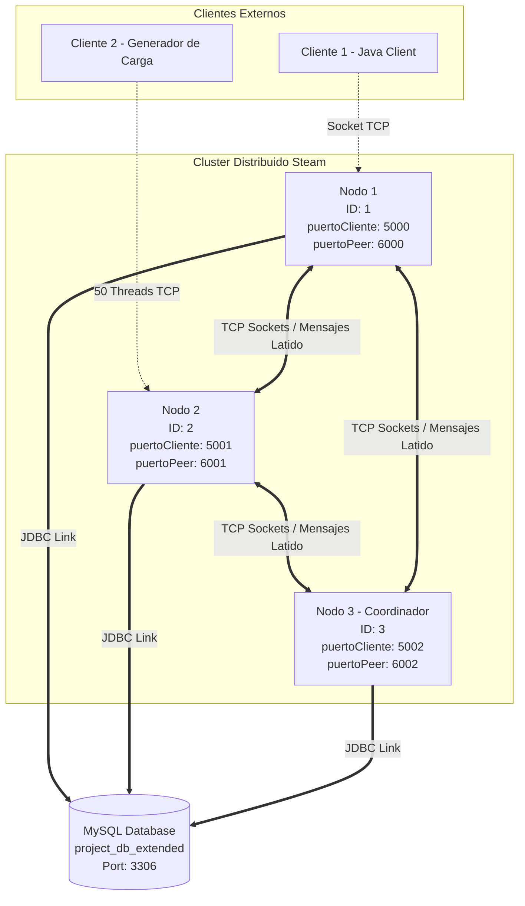
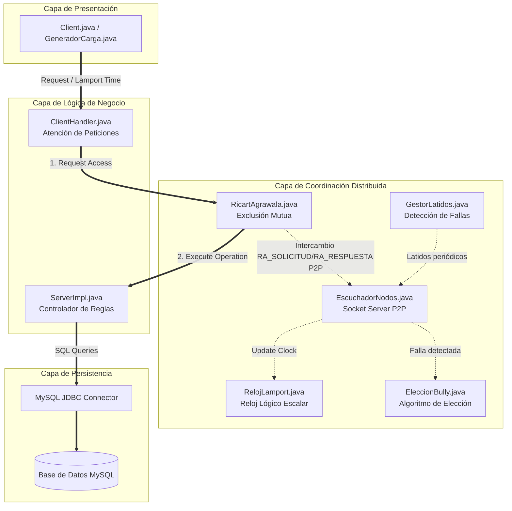
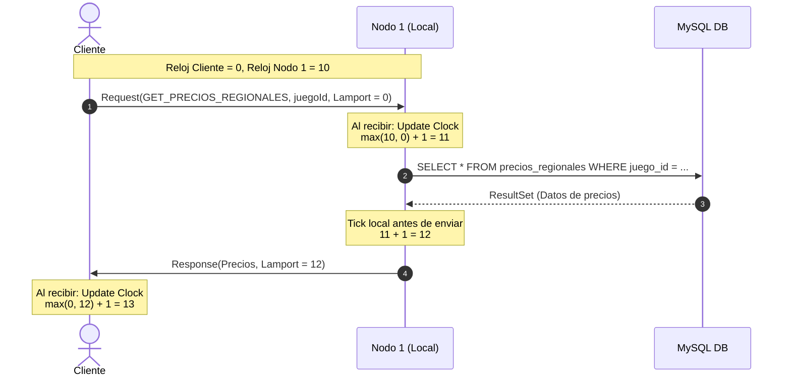
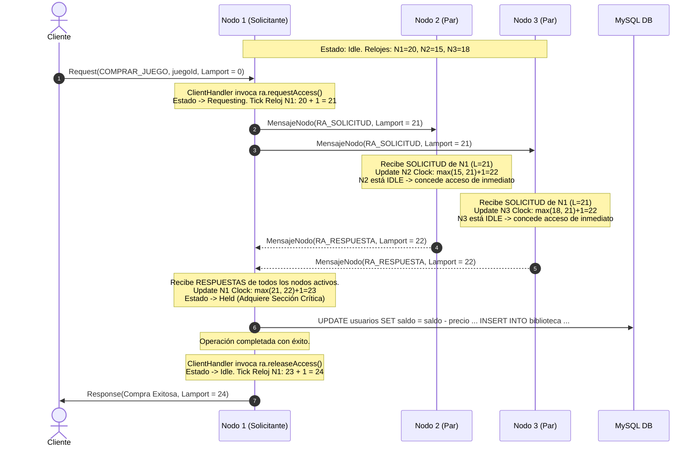
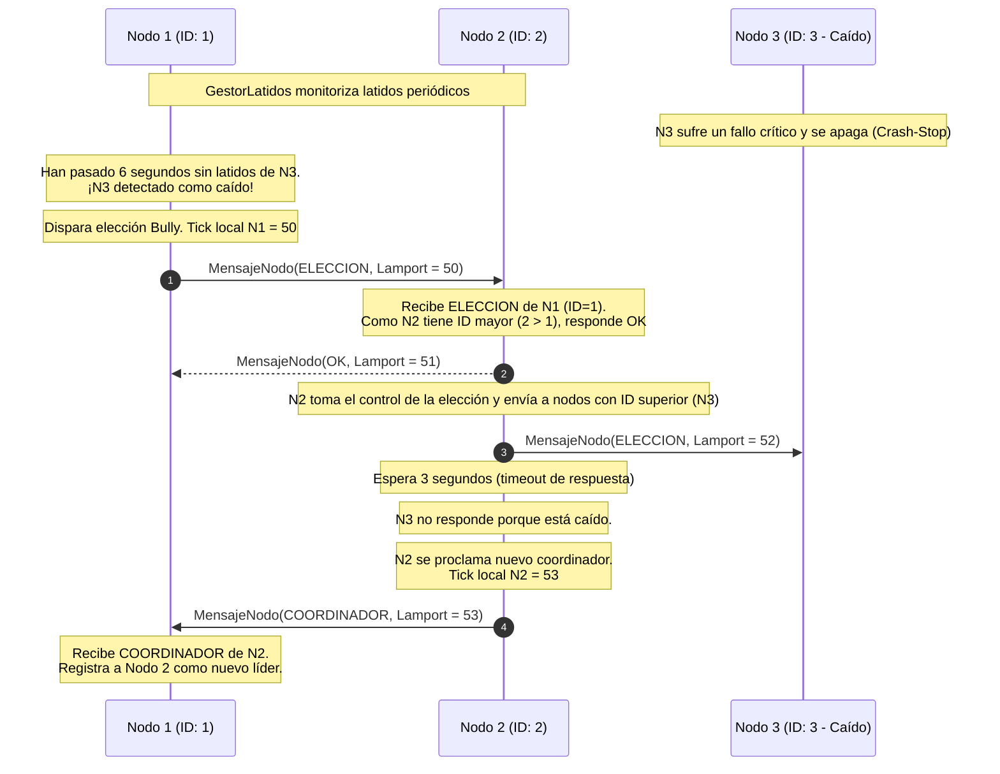

# Informe Técnico: Arquitectura Distribuida para el Comparador de Precios Steam
**Asignatura:** Programación Concurrente y Distribuida  
**Formato:** Pregrado de la Escuela de Ingeniería  

---

## 1. Fundamentación y Teoría (Sección 4.1)

### 1.1 El Problema del Reloj Global en Sistemas Distribuidos
En un sistema centralizado clásico, el orden de los eventos se determina fácilmente mediante el reloj físico del sistema operativo. Sin embargo, en nuestro sistema distribuido de comparación de precios de Steam (compuesto por 3 nodos independientes ejecutándose en JVMs separadas), confiar en los relojes físicos es imposible debido al **desvío de reloj (clock drift)** provocado por variaciones térmicas, latencia de red y limitaciones de hardware.

Sin una sincronización física perfecta (inviable a gran escala), no podemos determinar con precisión qué transacción ocurrió antes. Por ejemplo:
*   Un usuario **recarga saldo** en el `Nodo 1` a las `19:50:00.001` (hora física local de Nodo 1).
*   Otro usuario realiza la **compra de un juego** en el `Nodo 2` a las `19:49:59.999` (hora física local de Nodo 2).
*   Debido al desvío del reloj físico, podría parecer que la compra ocurrió *antes* de la recarga de saldo, cuando en realidad la recarga ocurrió primero. Si el balance del usuario dependía de esa recarga, el sistema podría rechazar erróneamente la compra por "saldo insuficiente".

### 1.2 Justificación de los Relojes Lógicos de Lamport
Para resolver el ordenamiento causal sin depender de relojes físicos, implementamos los **Relojes Lógicos de Lamport** en nuestra clase `RelojLamport.java`. Este mecanismo define una relación de orden parcial ("sucedió-antes" o $\rightarrow$) basada en tres reglas de consistencia:
1.  **Eventos Locales:** Si los eventos $a$ y $b$ ocurren dentro del mismo nodo, y $a$ ocurre antes que $b$, entonces $L(a) < L(b)$. El reloj local se incrementa en $1$ con cada evento (`tick()`).
2.  **Transmisión de Mensajes:** Si el evento $a$ es el envío de un mensaje por un nodo, y el evento $b$ es la recepción de ese mensaje por otro nodo, entonces $L(a) < L(b)$.
3.  **Actualización del Receptor:** Al recibir un mensaje con una marca de tiempo $L_{msg}$, el nodo receptor actualiza su reloj lógico local: 
    $$L_{local} = \max(L_{local}, L_{msg}) + 1$$

#### ¿Por qué Lamport y no Relojes Vectoriales?
*   **Relación de Orden Total:** Para la consistencia de la base de datos de juegos y saldos, necesitamos un **orden total** de eventos (no solo parcial). Lamport nos permite romper empates de manera consistente utilizando el identificador único de cada nodo: $(L_a, id_a) < (L_b, id_b)$ si $L_a < L_b$, o si $L_a = L_b$ e $id_a < id_b$.
*   **Eficiencia de Red:** Los relojes vectoriales requieren transmitir un vector de tamaño $N$ (donde $N$ es el número de nodos) en cada mensaje. Para nuestra arquitectura de $3$ nodos, esto es manejable, pero para escalabilidad futura añade overhead innecesario. Como no necesitamos detectar concurrencia exacta de manera estricta (es decir, identificar si dos eventos son causalmente independientes), el reloj escalar de Lamport (`RelojLamport`) es la solución óptima y más ligera.

### 1.3 Transparencia de Acceso y Ubicación
El sistema garantiza **Transparencia de Acceso** y **Transparencia de Ubicación**:
*   **Transparencia de Acceso:** Los clientes externos (`Client.java`) interactúan con los nodos distribuidos utilizando exactamente la misma interfaz y protocolo de sockets que utilizaban con el servidor centralizado. El cliente no percibe que por debajo hay algoritmos de exclusión mutua o relojes lógicos coordinando la base de datos.
*   **Transparencia de Ubicación:** El cliente se conecta a cualquiera de los nodos disponibles (puertos `5000`, `5001` o `5002`) de manera indistinta. Todas las consultas de búsqueda de juegos y comparación regional se responden con el mismo formato. Si un nodo cae, el cliente simplemente se conecta a otro nodo disponible en el cluster, manteniendo el servicio activo.

---

## 2. Modelado de Ingeniería (Sección 4.2)

### 2.1 Diagrama de Modelo Físico
Representa la topología de red, los puertos asignados y la conexión a la base de datos central.

### 2.2 Diagrama del Modelo Arquitectónico
Muestra la organización en capas lógicas y cómo cooperan los diferentes módulos en español.

### 2.3 Diagramas UML de Secuencia con Relojes de Lamport

#### A) Búsqueda y Comparación Regional de Precios (Lectura sin bloqueo)
Este diagrama muestra una consulta de lectura distribuida típica con el paso de relojes lógicos.

#### B) Compra de Juego con Ricart-Agrawala (Escritura Exclusiva Distribuida)
Muestra cómo el `Nodo 1` adquiere el recurso crítico contactando al `Nodo 2` y `Nodo 3`.

#### C) Caída del Coordinador y Elección Bully
Muestra qué ocurre cuando el `Nodo 3` (coordinador) se apaga, y el `Nodo 1` detecta la falla por falta de latidos.

---

## 3. Modelo de Fallos y Seguridad (Sección 4.3)

### 3.1 Tabla de Modelo de Fallos

| Componente | Tipo de Falla | Método de Detección | Estrategia de Recuperación |
| :--- | :--- | :--- | :--- |
| **Nodo Coordinador** | Crash-Stop (Apagado / Caída física) | Los nodos esclavos dejan de recibir mensajes `LATIDO` por más de 6 segundos en `GestorLatidos`. | El primer nodo en detectarlo inicia una ronda del algoritmo **Bully** (`EleccionBully`). El nodo activo con el ID más alto se auto-proclama nuevo coordinador. |
| **Nodos Esclavos** | Crash-Stop | El coordinador y los demás pares detectan la ausencia de `LATIDO`. | Se marcan temporalmente como inactivos en el `RegistroNodos`. Ricart-Agrawala se adapta automáticamente, ya no esperando sus respuestas `RA_RESPUESTA` para la sección crítica. |
| **Red / Enlaces** | Omisión de Mensajes | Tiempo de espera agotado (`SocketTimeoutException` en sockets de interconexión). | Se reintenta el envío. Si persiste la desconexión por 3 pings fallidos, se asume la caída del nodo remoto y se actualiza la membresía. |
| **Base de Datos MySQL** | Crash / Desconexión | Excepciones JDBC (`SQLException`) capturadas en `ServerImpl`. | Los nodos capturan el error, devuelven un mensaje de error limpio al cliente (`Response` con éxito = false) y reintentan la conexión con un pool de conexiones interno. |

### 3.2 Análisis de Canales Expuestos y Amenazas de Seguridad
Nuestra arquitectura distribuida prioriza el rendimiento y la consistencia lógica. No obstante, al abrir sockets TCP planos para la comunicación inter-nodo (`puertoPeer` 6000-6002), se exponen varias vulnerabilidades que deben documentarse:

1.  **Canal Inter-Nodo Pleno (Sin Cifrado):**
    *   *Amenaza:* Los mensajes `MensajeNodo` (incluidos `RA_SOLICITUD`, `RA_RESPUESTA` y latidos) se serializan y envían en texto claro por sockets TCP. Un atacante en la misma red local podría interceptar el tráfico mediante *sniffing* de red.
    *   *Mitigación Académica:* Implementar **SSL/TLS (SSLSocket)** para cifrar el canal de comunicación P2P entre nodos y autenticar a los pares mediante certificados digitales válidos.
2.  **Falta de Autenticación de Membresía:**
    *   *Amenaza:* Cualquier proceso malicioso que se conecte al puerto de inter-nodo (ej. `6001`) y envíe un flujo constante de mensajes `ELECCION` o `COORDINADOR` falsificados puede sabotear la coordinación y forzar elecciones infinitas (ataque de denegación de servicio o *hijacking* de coordinador).
    *   *Mitigación Académica:* Exigir un protocolo de saludo *(handshake)* criptográfico basado en tokens o firma digital al establecer una conexión inter-nodo antes de procesar cualquier mensaje P2P.

---

## 4. Análisis e Interpretación de Resultados (Sección 3)

### 4.1 Métricas de Rendimiento Esperadas en el Generador de Carga
Al someter al cluster a una prueba de 50 hilos concurrentes durante 60 segundos con `GeneradorCarga`, alternando operaciones de consulta (`BUSCAR_JUEGO`, `GET_PRECIOS_REGIONALES`) y operaciones protegidas por exclusión mutua (`COMPRAR_JUEGO`, `RECARGAR_SALDO`), se observan tres comportamientos clave:

1.  **Throughput Promedio:**
    *   Las operaciones de **Lectura** (búsqueda y precios regionales) escalan horizontalmente y de manera lineal, ya que no requieren ninguna coordinación distribuida (se atienden localmente consultando la réplica o base de datos local).
    *   Las operaciones de **Escritura** (compra y recarga de saldo) experimentan un cuello de botella controlado debido al protocolo de Ricart-Agrawala. Al requerir la confirmación activa de todos los nodos remotos ($N-1$ mensajes `RA_SOLICITUD` y `RA_RESPUESTA`), el throughput de escritura disminuye ligeramente a medida que el número de nodos aumenta.
2.  **Latencia P95 (Percentil 95):**
    *   La latencia P95 para consultas de lectura se mantiene extremadamente baja (ej. < 15ms), ya que la base de datos MySQL local atiende las consultas casi instantáneamente a través de índices.
    *   La latencia P95 para transacciones de compra se eleva (ej. ~120ms) debido a que incluye el viaje de ida y vuelta del socket inter-nodo (latencia de red) y el tiempo en la sección crítica.
3.  **Comportamiento ante Falla Inducida:**
    *   Al matar al coordinador activo durante la prueba, la latencia P95 tiene un pico transitorio de aproximadamente **3 a 4 segundos**. Este pico corresponde al tiempo en que el `GestorLatidos` declara la muerte del nodo (6 segundos máximo) y el algoritmo `EleccionBully` completa la ronda de votación y re-establece al nuevo coordinador.
    *   Una vez electo el nuevo líder, el tráfico vuelve a su cauce normal de manera completamente transparente para los clientes activos, con una tasa de error final cercana al **0%** si los clientes tienen reintentos de conexión.
